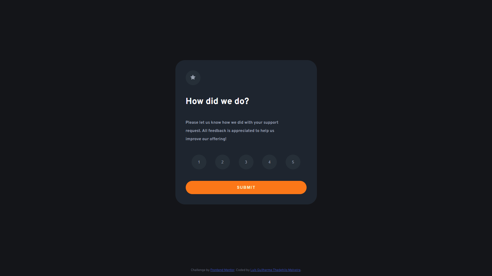
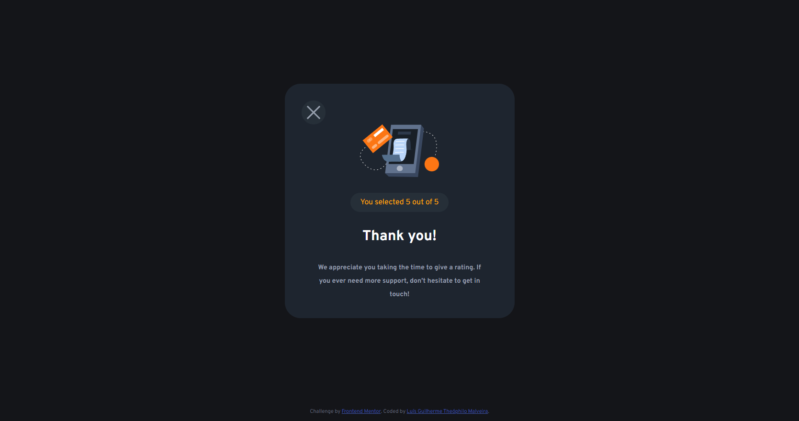

# Desafio: Interactive rating component (Frontend Mentor)

## Bem-vindo! 👋

Nesse projeto vou treinar HTML/CSS e começar a aprender a fazer interatividade na pagida HTML com o JavaScript.

Esta é uma solução para o [Interactive rating component no Frontend Mentor](https://www.frontendmentor.io/challenges/interactive-rating-component-koxpeBUmI).

## Índice:

- [Visão Geral](#visao-geral)
  - [O desafio](#o-desafio)  
  - [Link do Projeto](#link-do-projeto)
  - [Screenshots](#screenshots)
- [Meu processo](#meu-processo)
  - [Feito com](#feito-com)
  - [O que Aprendi](#o-que-aprendi)
  - [Recursos úteis](#recursos-úteis)
- [Autor](#autor)

# Visão Geral

## O Desafio

##### O desafio é construir esse layout de classificação interativo e fazê-lo parecer o mais próximo possível do design.

###### Seus usuários devem ser capazes de:

- Visualizar o layout ideal para o aplicativo, dependendo do tamanho da tela do dispositivo
- Ver os estados de foco para todos os elementos interativos na página
- Selecionar e enviar uma classificação numérica
- Ver o estado do cartão "Obrigado" após enviar uma avaliação

## Link do Projeto

- PROJETO - [Interactive rating component - Proposto pelo Front-end Mentor](https://luisguilhermemalveira.github.io/Projeto-interactive-rating/)

### Screenshots
##### Site Desktop

## Meu processo

### Feito com

- HTML5
- Flexbox
- CSS Grid
- Javascript

### O que aprendi

- Manipular o DOM com o Javascript.

### Recursos úteis

- Utilizei o [Figma](https://www.figma.com/) para descobrir algumas distâncias e cores.

## Autor

- Website - [Luís Guilherme Theóphilo Malveira](https://github.com/LuisGuilhermeMalveira)
- Frontend Mentor - [@LuisGuilhermeMalveira](https://www.frontendmentor.io/profile/LuisGuilhermeMalveira)
- LinkedIn - [luisguilhermemalveira](https://www.linkedin.com/in/luisguilhermemalveira/)
